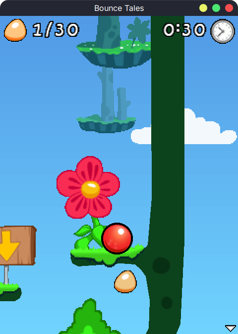

# BounceTales.NET

A port of the 2008 game Bounce Tales to C# based on
the [java decompilation by HelloOO7](https://github.com/HelloOO7/BounceTales). The code has been manually ported without
AI assistance. The project began in late 2024 and was periodically abandoned and resumed until one day I decided to give
it my all and slowly turn it into what it is today.

# Features

- Full source code ported to C#
- Classes like Matrix were converted to structs, additionally AABB and Vector2I structs were added among other things.
- Platform agnostic and NativeAOT compatible (meaning it can be compiled to native code!)
- Software graphics backend
- Raylib backend
- Godot backend

# How to play

Download the respective executable for your machine over at the releases page. If this is your first time running you'll
need to provide a copy of the game in .jar format. Bounce Tales version 2.0.25 works best.
While the jar file contains java bytecode, this is not used as the game's assets is what we really need it for.

# Projects used

- [HelloOO7/BounceTales](https://github.com/HelloOO7/BounceTales)
- [Raylib-cs (and raylib)](https://github.com/raylib-cs/raylib-cs)
- [Godot: Game engine](https://github.com/godotengine/godot)
- [MeltySynth: SoundFont synthesizer](https://github.com/sinshu/meltysynth)
- [Big Gustave: PNG decoder and encoder](https://github.com/EliotJones/BigGustave)
- [Proggy Forever: Used as a font for the Godot backend](https://github.com/ocornut/proggyforever)
- [Chaos Bank v1.9: Used as the default SoundFont](https://rkhive.com/banks.html)